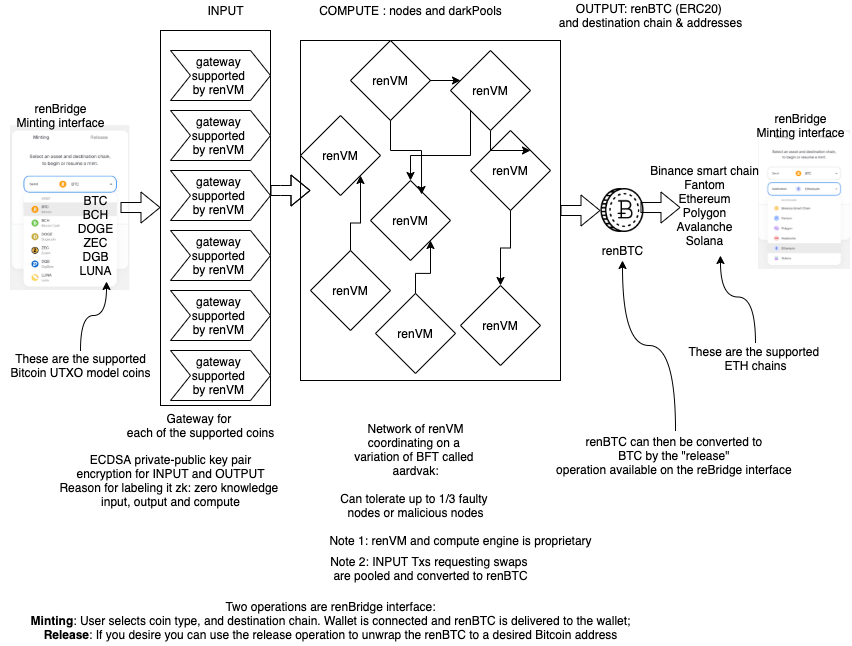

The renBridge interface works. Now I have some renBTC asset in my Metamask wallet via renBridge. I minted BTC to renBTC via renBridge.

We are are trying of ren-js. BTC to Rinkeby eth chain, by deploying ren-JS in the github repo.

Source is always BTC-based coins: limited set.
Destination is always ETH based chains.
Product is always renBTC.

Here is my view of whats going on in the limited functionality of ren that is accessible.

