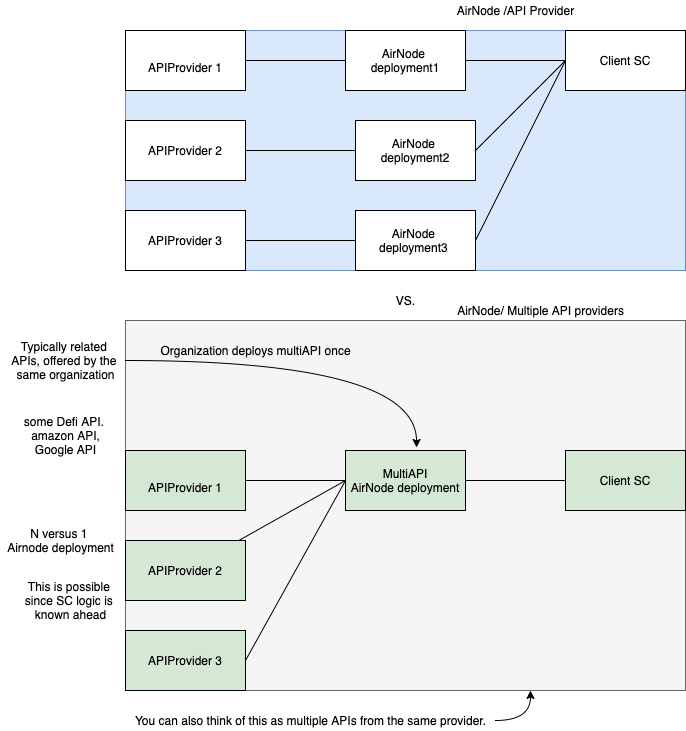

## Positioning the role of AirNode API3
SC cannot access external data by traditional request -response and also for storing and retrieving data.
This rule ensures consistent functioning of a deployed SC.

So what should an SC do when its wants the services of an API? How should an API provider serve their data to an SC?
Using an oracle service.

AirNode provides a first-party oracle services where an API provider deployes an AirNode to serve as an oracle provider for their API service.

## The multiple API Airnode POC implemented

